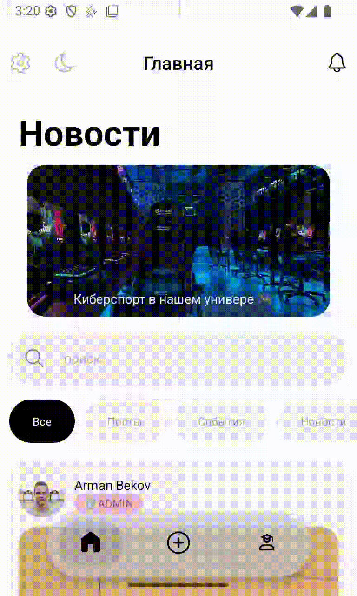
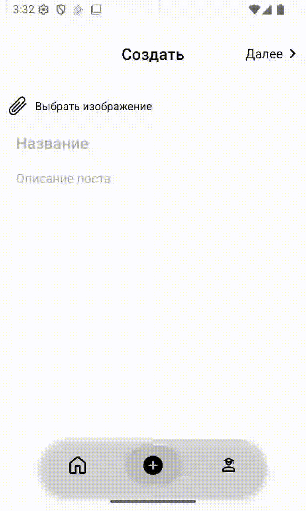
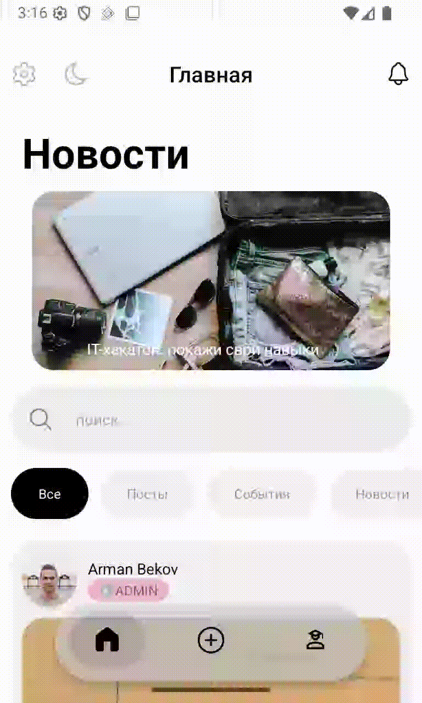

    
    
    

Mobile application for publishing and viewing internal university announcements, news, and events for students and staff.

## Table of contents

- [Preview](#preview)
- [Tech stack](#tech-stack)
- [Screens](#screens)
- [Features](#features)
  - [Home](#home)
  - [Post](#post)
  - [Settings](#settings)
- [Future Improvements](#future-improvements)

## Preview

<!--  -->

## Tech stack

- TypeScript

Frontend

- React Native (Expo)
- Redux toolkit, RTK Query
- expo router
- i18next

Backend

- Nest.js
- PostgreSQL
- Prisma ORM

## Screens

- Home (Feed)
- Create post
- Post details
- Profile
- Settings
- Signup / Login

## Features

- 🔐 Authentication (JWT)
- 📝 Post CRUD (create, read, delete)
- 🔍 Search & filtering
- 👤 User profiles
- 🌙 Dark / Light theme
- 🌐 Multi-language support (i18next)
- 📤 Share posts
- 🖼 Image upload (Expo ImagePicker)

### Home

<!--  -->
<!--  -->

    
    

### Post

<!--  -->
<!--  -->

    
    

### Settings

<!--  -->

## Future Improvements

- Edit posts functionality
- Likes and comments system
- Push notifications
